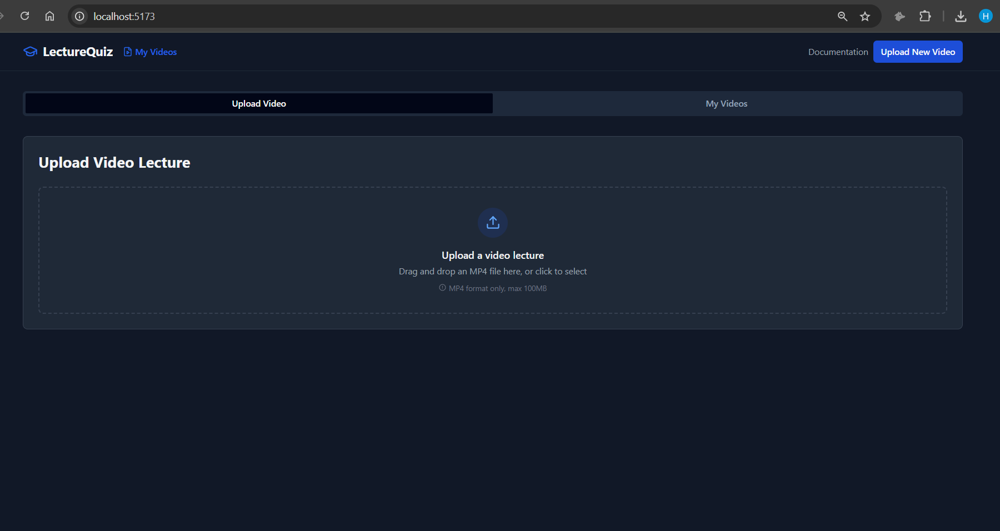
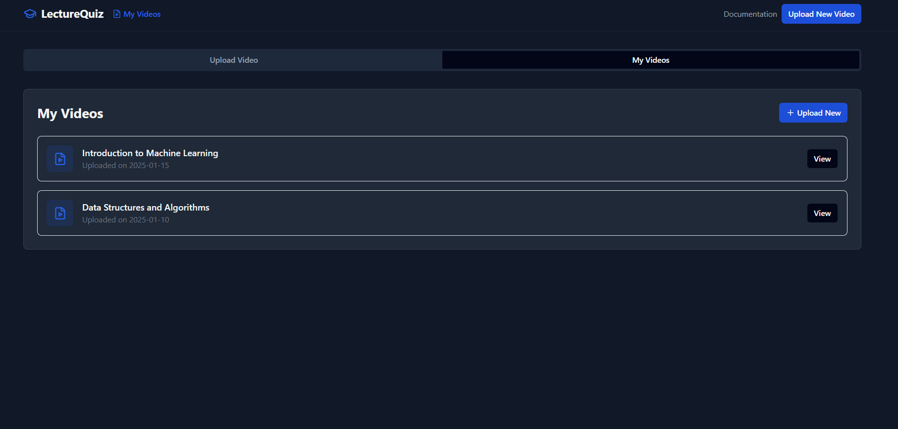

## Video Lecture Transcription & MCQ Generator

A full-stack web application that processes video lectures, generates text transcripts, and automatically creates multiple-choice questions (MCQs) for each segment. The app features a modern, polished interface and demonstrates core MVP functionality.

---

### 🚀 Features

- **Video Upload**

  - Drag-and-drop MP4 upload with a 100MB file size limit
  - Real-time progress tracking and file validation

- **Video Processing Pipeline**

  - Multi-stage processing with status updates
  - Progress indicators for each stage
  - Error handling and recovery

- **Transcript Generation**

  - Segments videos into 5-minute chunks
  - Generates synchronized text transcripts
  - Displays transcripts alongside the video player

- **MCQ Generation**

  - Auto-generates multiple-choice questions for each transcript segment
  - Edit questions and answer options
  - Export functionality (e.g., JSON, CSV)

- **User Interface**
  - Responsive design with dark mode support
  - Tab-based navigation and toast notifications
  - Polished animations and clear information hierarchy

---

### 🛠️ Tech Stack

| Tier        | Technology                   |
| ----------- | ---------------------------- |
| Frontend    | React 18, TypeScript, Vite   |
| Styling     | Tailwind CSS, ShadCN UI      |
| Data Fetch  | React Query                  |
| Routing     | React Router                 |
| Icons       | Lucide React                 |
| Upload      | React Dropzone               |
| Backend     | Node.js, Express, TypeScript |
| File Upload | Multer                       |
| API         | RESTful architecture, CORS   |

---

### 📦 Installation

1.  **Clone the repository**

    ```bash
    git clone https://github.com/your-username/video-mcq-generator.git
    cd video-mcq-generator
    ```

2.  **Install dependencies**

    #### Frontend

            cd frontend
            npm install

    #### Backend

                cd ../backend
                npm install

3.  **Environment Variables**

    ```bash
     PORT=4000
     MONGODB_URI=your_mongo_connection_string
     AI_API_KEY=your_ai_service_key

    ```

4.  **Clone the repository**

            # Backend
            cd backend
            npm run dev

            # Frontend
            cd ../frontend
            npm run dev

## ⚙️ Usage

    Open your browser and navigate to http://localhost:3000.

    Upload an MP4 lecture via drag-and-drop.

    Watch the simulated processing stages and progress indicators.

    View the generated transcript and auto-generated MCQs.

    Edit questions, export content, or integrate further AI services in production.

## 🧩 Future Improvements

    Integrate real AI services for transcript and MCQ generation

    Persist data in MongoDB and support user authentication

    Add pagination, search, and filtering for transcripts/questions

    Enhance export formats (e.g., PDF generation)

    Accessibility improvements and internationalization (i18n)

## 🎬 Screenshots






